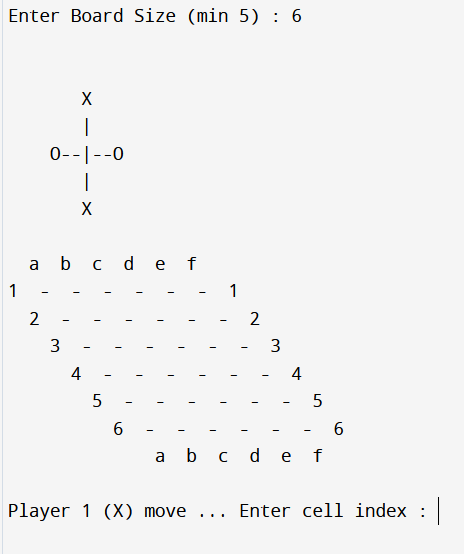
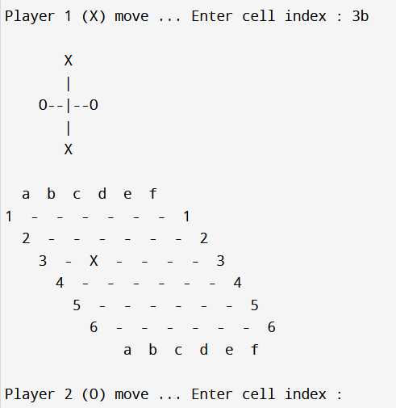
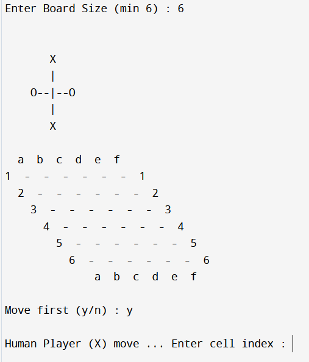
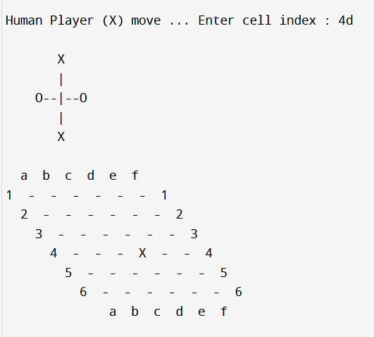
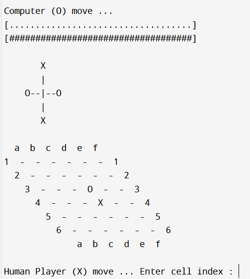

# Hex With C++

## Overview

This repository contains an implementation of the Hex game using C++. The game offers both two-player mode and AI mode, providing an engaging way to enjoy this classic board game.

## Features

- **Two-Player Mode:** Allows two human players to compete against each other.
- **AI Mode:** Offers a challenging AI opponent for solo play.

## Visuals

Below are some images demonstrating the game interface and gameplay:

<div style="display: flex; justify-content: space-between;">
  
  
</div>

<div style="display: flex; justify-content: space-between;">
  
  
  
</div>

## Installation

1. Clone the repository:

    ```sh
    git clone https://github.com/adibakshi28/Hex-With-Cpp.git
    ```

2. Navigate to the project directory:

    ```sh
    cd Hex-With-Cpp
    ```

3. Compile the code:

    ```sh
    g++ -o HexGame "Hex with AI.cpp"
    ```

## Usage

1. Run the compiled program:

    ```sh
    ./HexGame
    ```

2. Gameplay Instructions:
    - On running the program, you will be prompted to choose between two-player mode and AI mode.
    - For two-player mode, players take turns entering their moves.
    - For AI mode, you will play against the computer, which will make strategic decisions.

## How to Play Hex

- The goal is to create an unbroken chain of your pieces connecting your two sides of the board.
- Players alternate turns, placing one piece per turn on any empty cell.
- The game ends when one player successfully connects their sides.

## Code Structure

### Hex with AI.cpp

- **Game Initialization:** Sets up the board, initializes players, and starts the game loop.
- **Game Logic:** Contains functions to handle player moves, check for win conditions, and switch turns.
- **AI Implementation:** Implements an AI opponent using strategic decision-making to challenge the player.
- **User Interface:** Handles input and output for players, displaying the board and messages.

## License

This project is licensed under the MIT License. See the [LICENSE](LICENSE) file for more details.

## Contributing

Contributions are welcome! To contribute:

1. Fork the repository.
2. Create a new branch for your feature or bug fix.
3. Commit your changes.
4. Push the branch and create a pull request.

## Contact

For any questions or feedback, please open an issue in the repository.

Enjoy playing Hex!
